<!-- LINKS
Ensino:
  http://dalelane.co.uk/blog/?p=3513
  https://machinelearningforkids.co.uk/#!/about
  https://medium.com/@ageitgey/machine-learning-is-fun-80ea3ec3c471
  https://medium.com/machine-learning-for-humans/neural-networks-deep-learning-cdad8aeae49b
  http://fortune.com/ai-artificial-intelligence-deep-machine-learning/

Aplicações FUN:
  Videogames https://www.leozqin.me/teaching-a-computer-to-play-video-games/

  https://www.forbes.com/sites/bernardmarr/2017/10/24/how-ai-and-machine-learning-are-used-to-transform-the-insurance-industry/#3534a12113a1

  https://www.forbes.com/sites/bernardmarr/2017/05/04/what-is-machine-learning-a-complete-beginners-guide-in-2017/#2bb481fc578f

  Carros http://readwrite.com/2016/12/20/ai-driving-future-autonomous-cars-tl4/

  Reinforcement Learning https://www.youtube.com/watch?v=hx_bgoTF7bs&feature=youtu.be

Praticas:
  Google Teachable Machine https://teachablemachine.withgoogle.com/
  Draw Completer https://magenta.tensorflow.org/assets/sketch_rnn_demo/index.html
  Draw Identifier https://www.autodraw.com/

FUTURO
  GAN https://github.com/junyanz/CycleGAN
-->

<!-- ESTRUTURA
 - Quem sou eu
    Alysson
    Ciencia da Computacao
    Mestrado Engenharia de Producao
    CSP Scrum
  Dono de Empresa de Desenvolvimento de Software (Facta mapa visitem)
 - O que é Machine Learning
    programacao tradicional
    aprendizagem por exemplos
 - Como funciona?
    Anti-SPAM Tradicional
      regras Nigeria
      regras Nigeria e Dinheiro
      regras Nigeria Dinheiro e Heranca
    Anti-SPAM ML
      emails spam
      emails não-spam
 - Algumas Aplicações
     Sugestoes (Netflix, Spotify)
     Predição (Manutenção Veículos, Seguros)
     Fraudes (Padroes no sistema financeiro, gastos publicos)
     Medicina (Cancer)
     Busca
     Processamento de linguagem (Moto-X, Alexa)
     Processamento de Imagens (Reconhecimento de Faces, Segurança)
     Carros Autonomos (Waymo, Uber, Tesla, Acidentes)
 - !Ao Vivo!
    Google Translate
    Gatos
    Beattles
    Sentimentos
 - O que vem por aí
    Veiculos Autonomos
    Criatividade (GAN, CycleGAN)
    Reinforcement Learning ()
 - Obrigado
 - Bonus
    Dilemas Morais
================
 - Dificuldades
    Quantidade de dados
      Google (fotos)
    Recursos Computacionais
      ingles frances = 2 semanas
      google x academia (500 gpus por 1 mes)
-->
# Machine Learning 101
por Alysson Mendonça

## 0. Motivação
  <video controls><source data-src="media/0_car_tesla.mp4" type="video/mp4" /></video>

## 1. Quem sou eu?

  ### Eu gosto de...
  

  ### E de...
  

  ### Também gosto de...
  

  ### e também de...
  

  ### Formação Acadêmica
  * Ciência da Computação <!-- .element: class="fragment" data-fragment-index="1" -->
  * Engenharia de Produção <!-- .element: class="fragment" data-fragment-index="2" -->

  ### Formação Profissional
  Accenture
  

  ### Formação Profissional
  Metodologias Ágeis
  

  Note: Accenture tem +300mil funcionários, faturamento anual de mais de 100 bilhões

  ### Facta
  Visitem ;)
  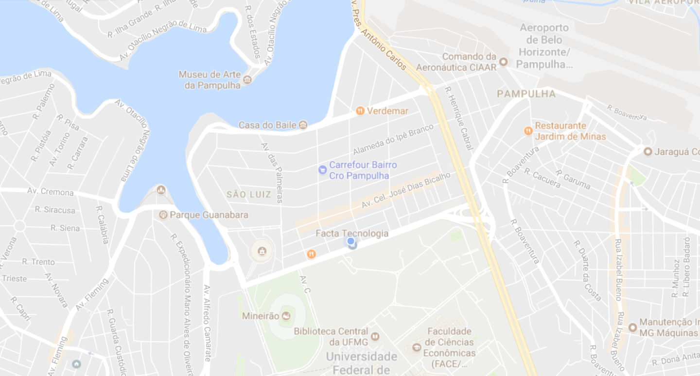

## 2. O que é Machine Learning?

  ### De onde saiu?
  <video controls><source data-src="media/2_de_onde_saiu_1.mp4" type="video/mp4" /></video>

  ### De onde saiu? (cont)
  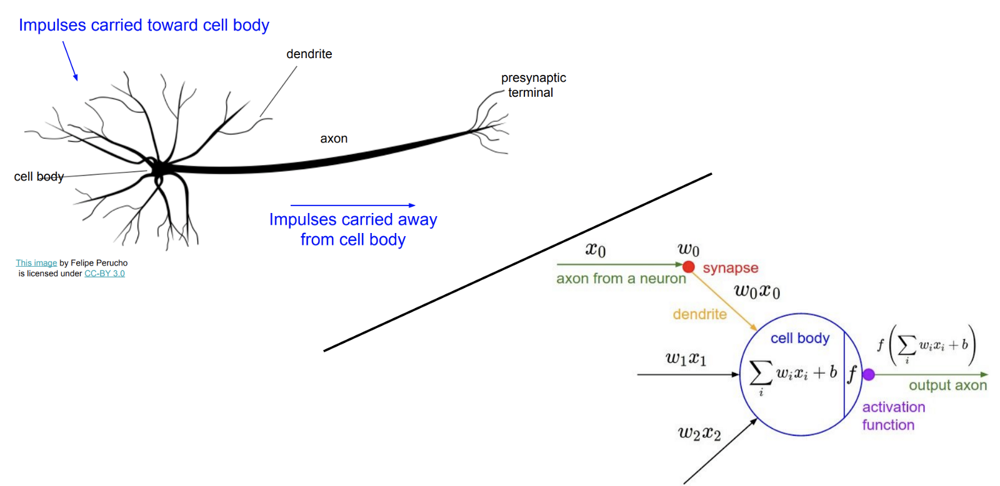

  ### Programação Tradicional
   <!-- .element: class="fragment" data-fragment-index="1" -->

  ### Programação Tradicional
  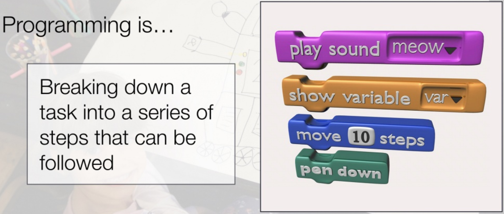

  ### Machine Learning
  Aprendizagem por Exemplos <!-- .element: class="fragment" data-fragment-index="1" -->

  ### Machine Learning
  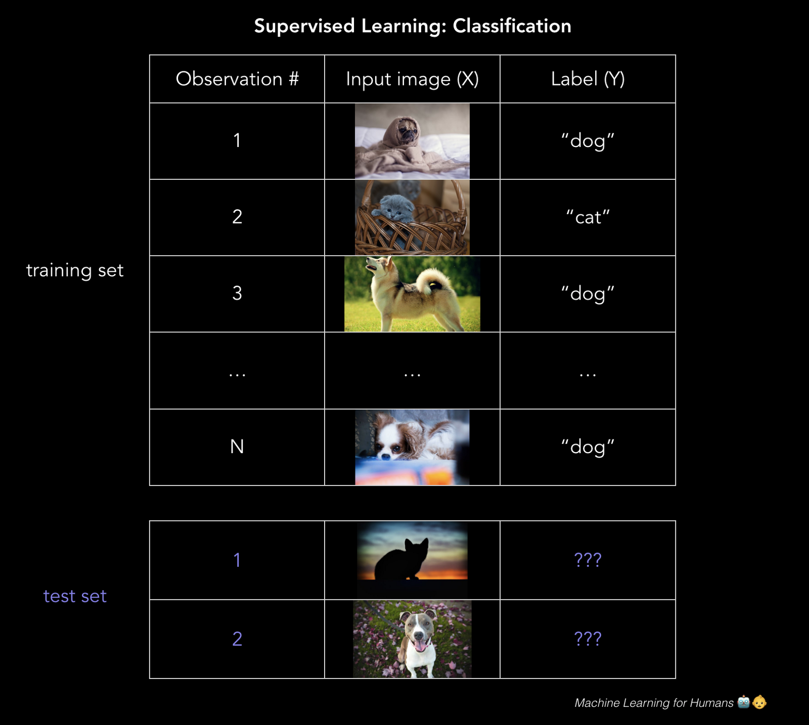

## 3. Como Funciona?

  ### Exemplo Prático
  _Alguém_ gosta de SPAM?

    ### Exemplo Prático
    

    ### Nigerian SCAM
    

    ### Nigerian SCAM
    

    ### Nigerian SCAM
    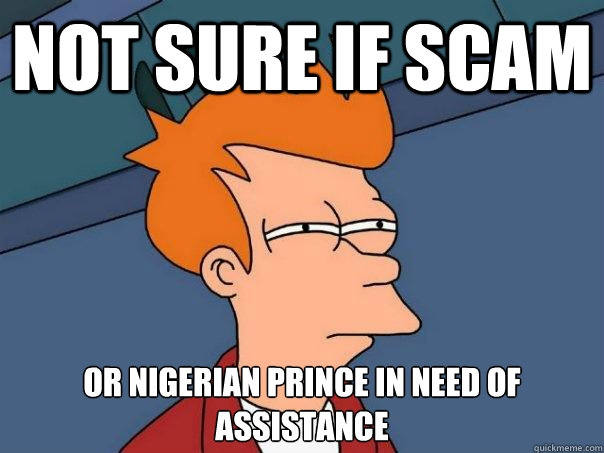

  ### Anti-SPAM Tradicional

    ### Tentativa 1 - País
      * Bloquear emails contendo _Nigéria_
      * Bloqueia emails da Nigéria! <!-- .element: class="fragment" data-fragment-index="1" -->

    ### Tentativa 2 - Conteúdo
      * Bloquear emails contendo _Nigéria e Dinheiro_
      * Bloqueia email de bancos! <!-- .element: class="fragment" data-fragment-index="1" -->
      * Bloqueia email de cobranças! <!-- .element: class="fragment" data-fragment-index="1" -->

    ### Tentativa 3 - Assunto
      * Bloquear emails contendo _Nigéria e Dinheiro e Herança ou Príncipe ou Transferência_
      * Ufa! Funciona! <!-- .element: class="fragment" data-fragment-index="1" -->
      * Até que... <!-- .element: class="fragment" data-fragment-index="2" -->

    ### Tentativa 4 - E agora?
    

  ### Anti-SPAM com _Machine Learning_
  Aprendendo com exemplos

    ### 1 - Pegue MUITOS Exemplos
    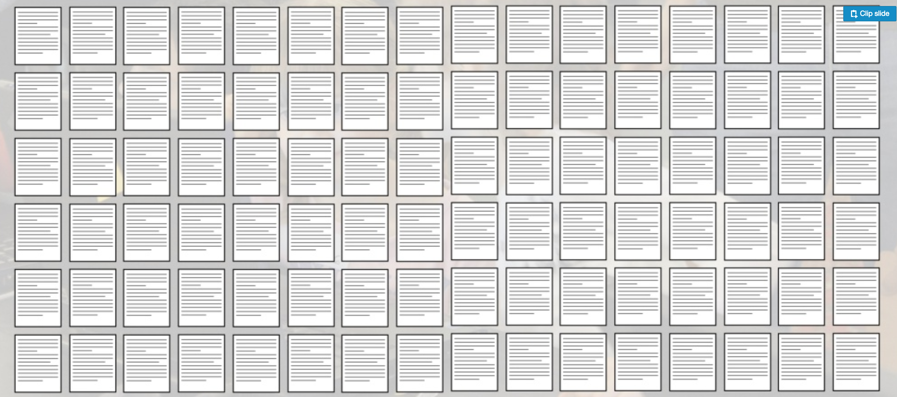

    ### 2 - Categorize cada Exemplo
    

    ### 3 - Separe as Categorias
    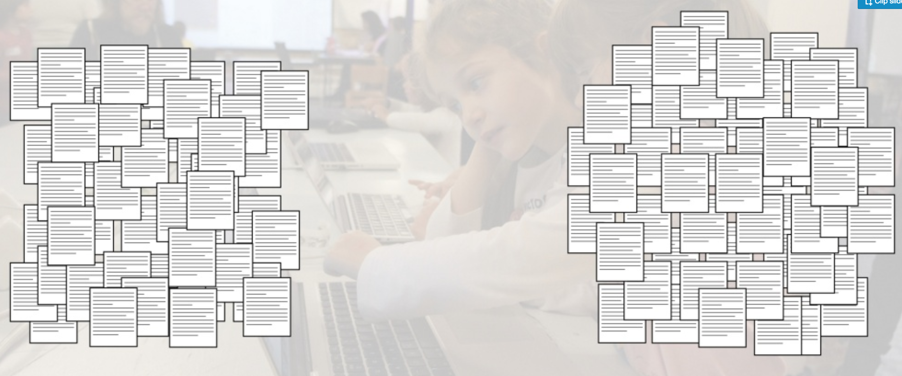

    ### 4 - Treine um modelo de ML
    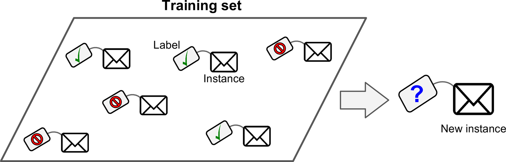

## 4. Aplicações de ML

  ### Reconhecimento de Sons
    

  ### Reconhecimento de Imagens
    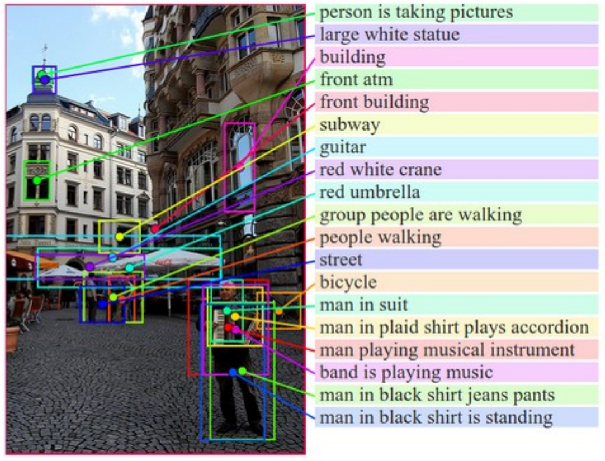

  ### Processamento de Linguagem Natural
    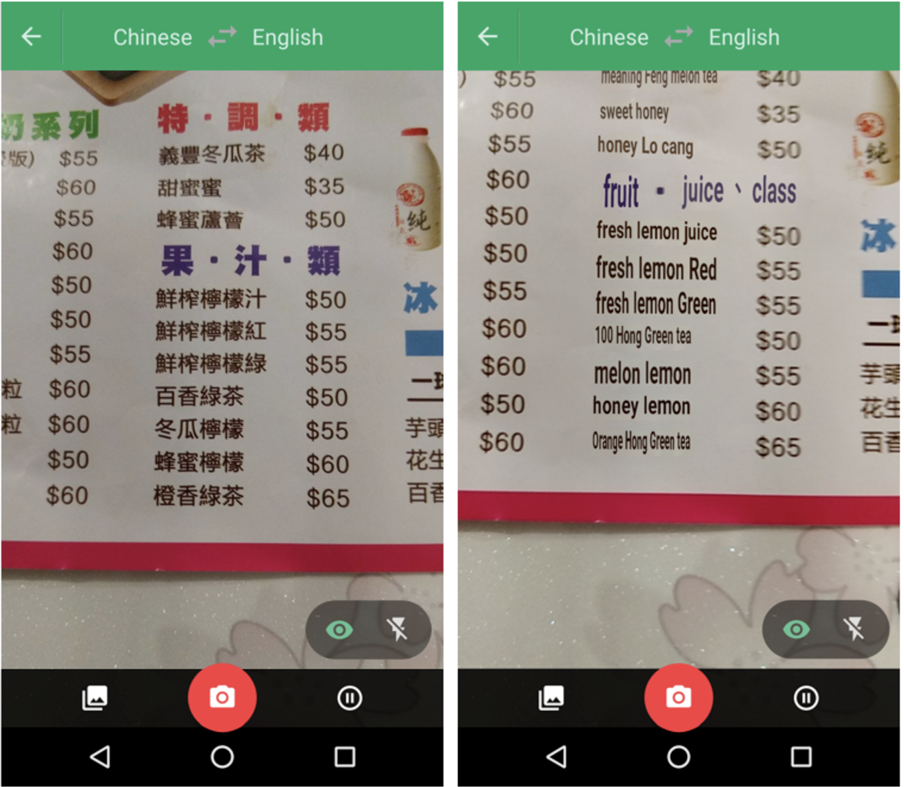

  ### Medicina
    * Diagnóstico
    * Prescrição
    * Prognóstico

  ### Medicina - Exemplo
    * Retinopatia Diabética
    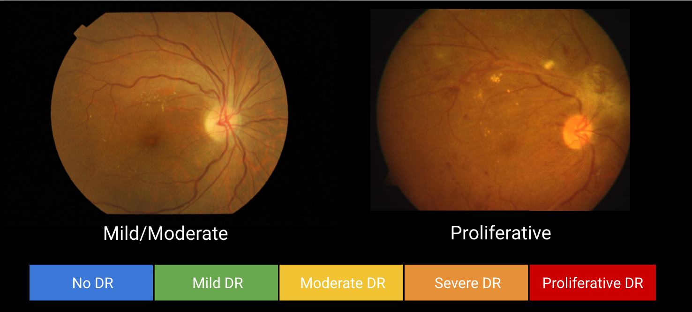

  ### Medicina - Outro Exemplo
    * Câncer de Mama
    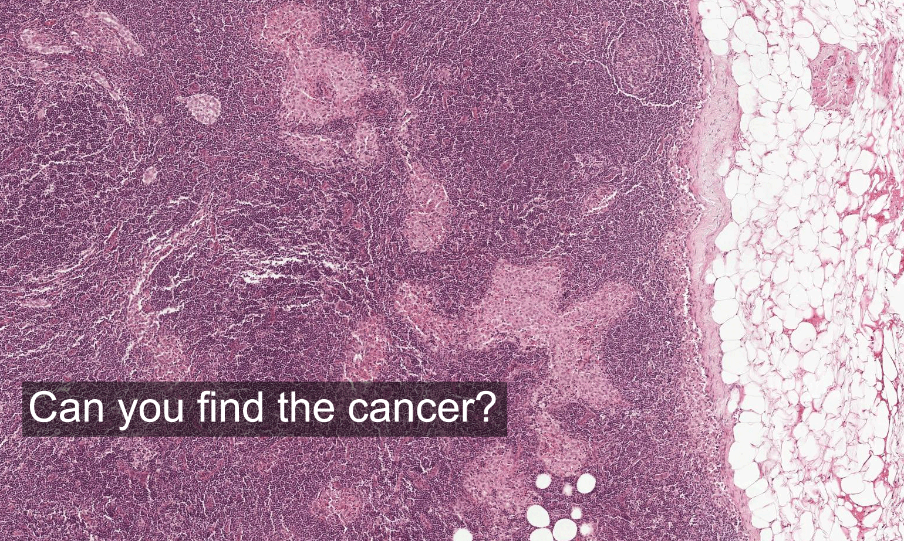

  ### Recomendações
    * Netflix, Spotify, Amazon...
    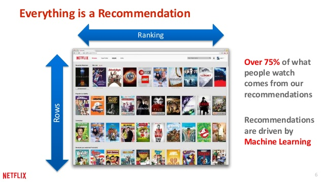

  ### Predição
    * Manutenção de Veículos e Máquinas
    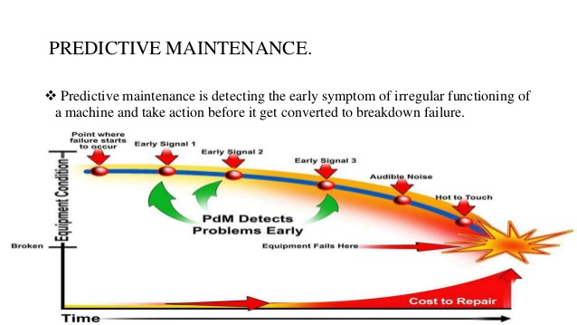

  ### Identificação de Fraudes
    * Compras em Cartão de Crédito, Gastos Públicos
    

  ### Logística
    <video controls><source data-src="media/4_logistica_truck.mp4" type="video/mp4" /></video>

  ### Maquinaria Pesada
    <video controls><source data-src="media/4_maquinaria_pesada.mp4" type="video/mp4" /></video>

## 5. O que vem por aí

  ### _"Criatividade"_
  

  ### Reinforcement Learning - 1
  <video controls><source data-src="media/6_rl_humanoid.mp4" type="video/mp4" /></video>

  ### Reinforcement Learning - 2
  <video controls><source data-src="media/6_rl_injured_robots.mp4" type="video/mp4" /></video>

  ### Reinforcement Learning - 3
  <video controls><source data-src="media/6_openai_dota.mp4" type="video/mp4" /></video>

## 6. _ML_ ao Vivo!

  ### Sketcher
  https://magenta.tensorflow.org/assets/sketch_rnn_demo/

  ### Teachable Machine
  https://teachablemachine.withgoogle.com/

## Obrigado!
  * Alysson Mendonça
  * @alymenbr
  * alymenbr@gmail.com

### 7. Bonus - Dilemas Morais
<video controls><source data-src="media/7_car_waymo.mp4" type="video/mp4" /></video>

### 7. Bonus - Dilemas Morais
<video controls><source data-src="media/7_car_dillema.mp4" type="video/mp4" /></video>

## Obrigado!
  * Alysson Mendonça
  * @alymenbr
  * alymenbr@gmail.com