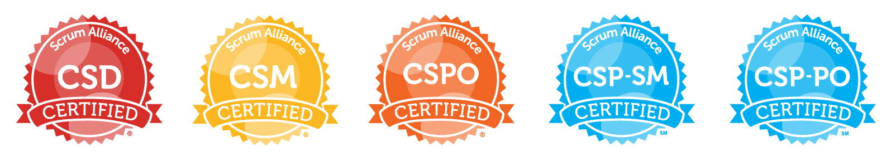
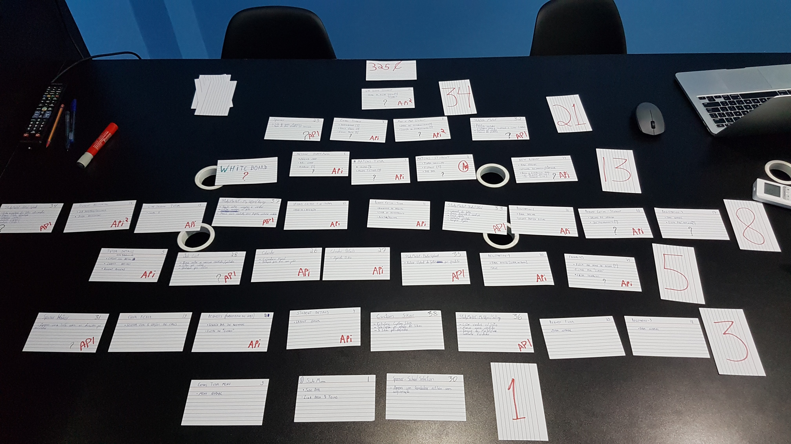
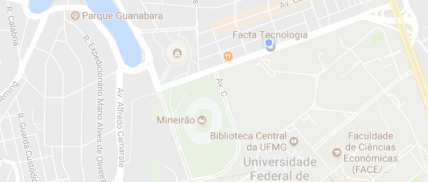

<!-- LINKS
Ensino:
  http://dalelane.co.uk/blog/?p=3513
  https://machinelearningforkids.co.uk/#!/about
  https://medium.com/@ageitgey/machine-learning-is-fun-80ea3ec3c471
  https://medium.com/machine-learning-for-humans/neural-networks-deep-learning-cdad8aeae49b
  http://fortune.com/ai-artificial-intelligence-deep-machine-learning/

Aplicações FUN:
  Videogames https://www.leozqin.me/teaching-a-computer-to-play-video-games/

  https://www.forbes.com/sites/bernardmarr/2017/10/24/how-ai-and-machine-learning-are-used-to-transform-the-insurance-industry/#3534a12113a1

  https://www.forbes.com/sites/bernardmarr/2017/05/04/what-is-machine-learning-a-complete-beginners-guide-in-2017/#2bb481fc578f

  Carros http://readwrite.com/2016/12/20/ai-driving-future-autonomous-cars-tl4/

  Reinforcement Learning https://www.youtube.com/watch?v=hx_bgoTF7bs&feature=youtu.be

Praticas:
  Google Teachable Machine https://teachablemachine.withgoogle.com/
  Draw Completer https://magenta.tensorflow.org/assets/sketch_rnn_demo/index.html
  Draw Identifier https://www.autodraw.com/

FUTURO
  GAN https://github.com/junyanz/CycleGAN
-->

<!-- ESTRUTURA
 - Quem sou eu
    Alysson
    Ciencia da Computacao
    Mestrado Engenharia de Producao
    CSP Scrum
  Dono de Empresa de Desenvolvimento de Software (Facta mapa visitem)
 - O que é Machine Learning
    programacao tradicional
    aprendizagem por exemplos
 - Como funciona?
    Anti-SPAM Tradicional
      regras Nigeria
      regras Nigeria e Dinheiro
      regras Nigeria Dinheiro e Heranca
    Anti-SPAM ML
      emails spam
      emails não-spam
 - Algumas Aplicações
     Sugestoes (Netflix, Spotify)
     Predição (Manutenção Veículos, Seguros)
     Fraudes (Padroes no sistema financeiro, gastos publicos)
     Medicina (Cancer)
     Busca
     Processamento de linguagem (Moto-X, Alexa)
     Processamento de Imagens (Reconhecimento de Faces, Segurança)
     Carros Autonomos (Waymo, Uber, Tesla, Acidentes)
 - !Ao Vivo!
    Google Translate
    Gatos
    Beattles
    Sentimentos
 - O que vem por aí
    Veiculos Autonomos
    Criatividade (GAN, CycleGAN)
    Reinforcement Learning ()
 - Obrigado
 - Bonus
    Dilemas Morais
================
 - Dificuldades
    Quantidade de dados
      Google (fotos)
    Recursos Computacionais
      ingles frances = 2 semanas
      google x academia (500 gpus por 1 mes)
-->
# Monopoly Business Value
Alysson Mendonça

## 1. Who am I?

  ### I like tech...
  

  ### and pets...
  

  ### and pianos :)
  

  ### I like to learn
  * Bsc. Computer Science
  * Msc. Production Engineering

  ### I _really_ like to learn
  

### 2. Business Value
  ## The 101

  ## Business Value
  * What is it? <!-- .element: class="fragment" data-fragment-index="1" -->
  * Why is it important? <!-- .element: class="fragment" data-fragment-index="2" -->  
  * Who takes care of it? <!-- .element: class="fragment" data-fragment-index="3" -->
  * PO ≠ Stakeholder <!-- .element: class="fragment" data-fragment-index="4" -->

  ## Backlog Example
    

  ## 1 day in the PO's life 
  * Stakeholders have desires <!-- .element: class="fragment" data-fragment-index="1" -->
  * Customers have suggestions <!-- .element: class="fragment" data-fragment-index="2" -->
  * Team needs INVEST Stories <!-- .element: class="fragment" data-fragment-index="3" -->
  * Prioritize, prioritize a lot and REALLY prioritize! <!-- .element: class="fragment" data-fragment-index="4" -->

  ## BV based prioritizing
  1. Define Product Backlog <!-- .element: class="fragment" data-fragment-index="1" -->
  1. Enforce Restrictions <!-- .element: class="fragment" data-fragment-index="2" -->
  1. (Optional) Stakeholders, Teams, Objectives <!-- .element: class="fragment" data-fragment-index="3" -->
  1. Distribute Wealth <!-- .element: class="fragment" data-fragment-index="4" -->

  ## Hands on!
  1. Define Product Backlog
  1. Enforce Restrictions
  1. Distribute Wealth

  ## Bônus
  ### ROI based prioritizing

### Thank you!
  ## Come visit Facta someday!
  
